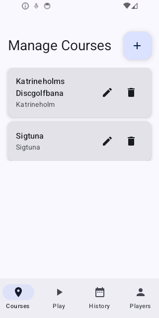
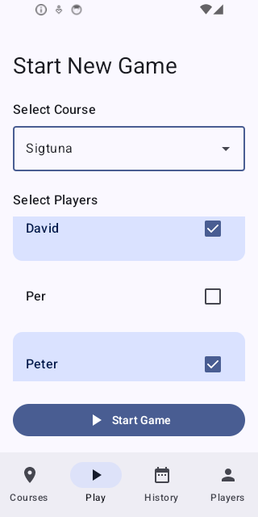
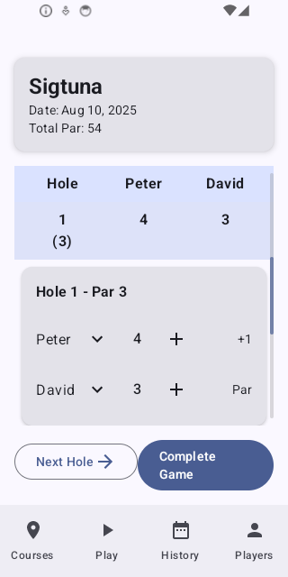
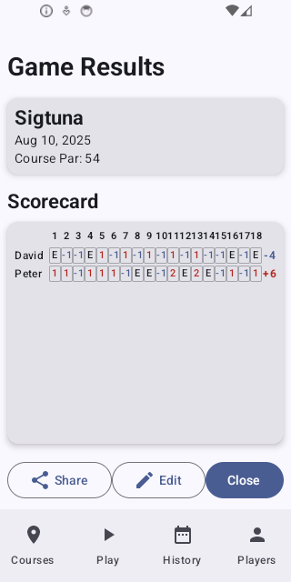

# Discman - DiscGolf Course and Score Management

A basic Android app for managing disc golf courses and tracking game scores. 

## Main Features

- **Course Management**: Add, edit, and delete disc golf courses with detailed hole information
- **Game Scoring**: Start games, add players, and track scores with a digital scorecard
- **Score History**: View previously played games and share results
- **Player Management**: Manage player database for easy game setup

## Main Views

### 1. Courses View

The **Courses View** is your central hub for managing disc golf courses. Here you can:
- View all saved courses in a clean list format showing course name and number of holes
- Add new courses by tapping the "+" button
- Edit existing courses by selecting them from the list
- Delete courses you no longer need

Each course entry displays the course name and total hole count, making it easy to identify and select the course you want to manage.

### 2. Start New Game

The **Start New Game** view allows you to set up a new disc golf game:
- **Course Selection**: Choose from your saved courses using the dropdown menu (courses are listed alphabetically)
- **Player Selection**: Add players to the game from your player database using the multiselect interface
- **Game Initialization**: Once you've selected a course and added players, tap "Start Game" to begin scoring

This streamlined interface ensures quick game setup so you can focus on playing disc golf rather than managing the app.

### 3. Game Scoring Card

The **Game Scoring Card** provides a digital version of a traditional disc golf scorecard with modern enhancements:
- **Game Details**: Shows course name, game date, and total par at the top
- **Current Hole Focus**: The active hole is expanded to show detailed scoring controls
- **Player Scoring**: For each player, you can adjust their throw count using +/- buttons
- **Score Calculation**: Scores are automatically calculated using standard disc golf rules (par, birdie, eagle, etc.)
- **Navigation**: Move between holes using "Next Hole" or by tapping any hole number
- **Game Completion**: Finish the game when all holes are completed

The interface prioritizes the current hole while keeping the full scorecard visible for context.

### 4. Score Card Results

The **Score Card Results** view displays the final game results in a classic disc golf scorecard format:
- **Tabular Layout**: Each hole appears as a column, each player as a row
- **Comprehensive Scoring**: Shows individual hole scores and running totals
- **Final Results**: Displays total scores for easy comparison between players
- **Sharing Options**: Share results via SMS or email
- **Game Management**: Option to reopen the game for editing or return to game history

This view provides a professional scorecard presentation that disc golf players will find familiar and easy to read.

## Technical Details

### Built With
- **Kotlin** - Primary programming language
- **Android Jetpack Compose** - Modern UI toolkit
- **Room Database** - Local data persistence
- **Hilt** - Dependency injection
- **Material Design 3** - UI components and theming

### Requirements
- Android 7.0 (API level 24) or higher
- 50MB available storage space

## Installation

### For Users
Download the latest APK from the [Releases](../../releases) page and install on your Android device.

### For Developers
1. Clone this repository
2. Open in Android Studio
3. Build and run on your device or emulator

## Contributing

This project follows standard Android development practices. Feel free to submit issues and pull requests.

## License

This project is open source and available under the [MIT License](LICENSE).
